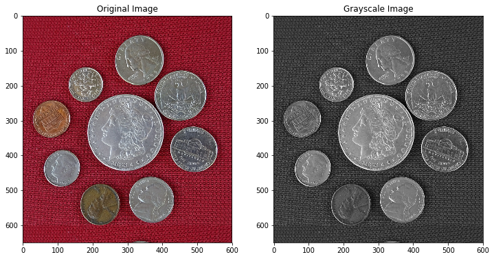
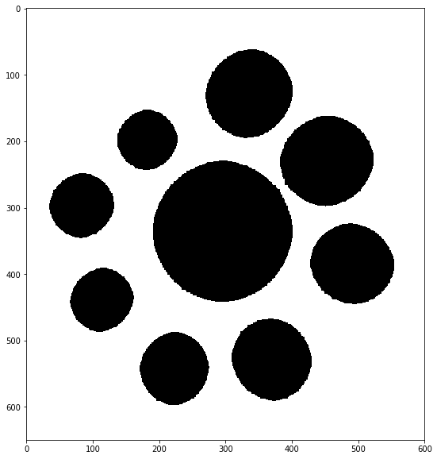
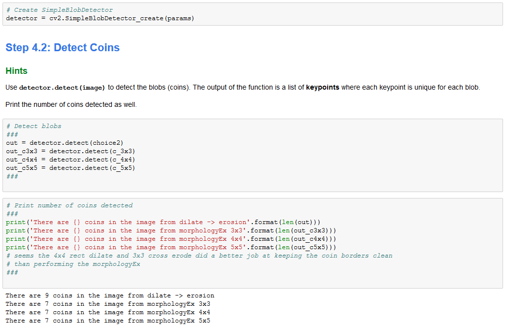
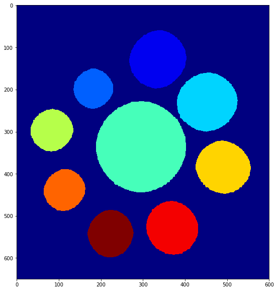
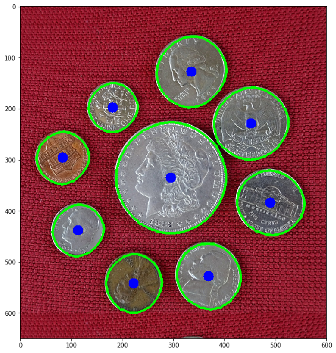

# Coin Detection With OpenCV

A short exercise consisting of detecting multiple coins using OpenCV in Python 3

I've left the empty cells(ones with pictures at the bottom) in there as comparisons of my results from OpenCV team's results for the assignment.

### Object

The objective of the exercise is to find the coins in the image and identify them by counting them or by displaying the contours or color.

The steps I used to achieve this are:

1. Obtain a binary image that best fits the target object. This is a critical part of the task, obtaining a binary image that has all of the target object and as little amount of false objects as I can get.

2. Performing morphology to further reduce the number of detected objects in the image. I want to obtain an image where our target object has the best representation to help with later processes(area, color, shape, etc.)

3. Filtering out false positive(thankfully I obtained a good mask so I did not have to do this part)

4. Feeding the binary image to the detectors: simple blob detector, Principal component analysis(PCA), and find contours + obtaining results

### Original Images + Grayscale Image

### 1. Resulting mask after performing thresholding on the R, G, B, then combining them

### 2. Cleaning the RGB mask by morphological operations

### 4a. Number of coins detected from simple blob detector.
I tried morphological operations with different kernels and fed the output to simple blob detector. Note that the output shows different results.
- The first result is by manually dilating using one kernel(4x4_cross) and then manually eroding using a different kernel(4x4_rect)
- The second, third, and fourth uses OpenCV's morphologyEx()(morhpological closing) using a 3x3_rec, 4x4_rect, and 5x5_rect. They didn't detect the right number of coins because two coins got merged into one huge blob because their borders were too close to each other.

### 4b. Coins detected using connected component analysis, note the number of different color on each coin + background color

### 4c. Coins detected using find contours

